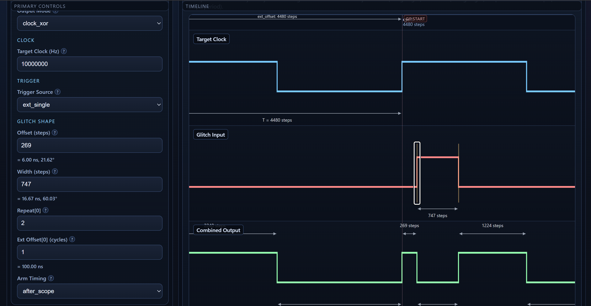
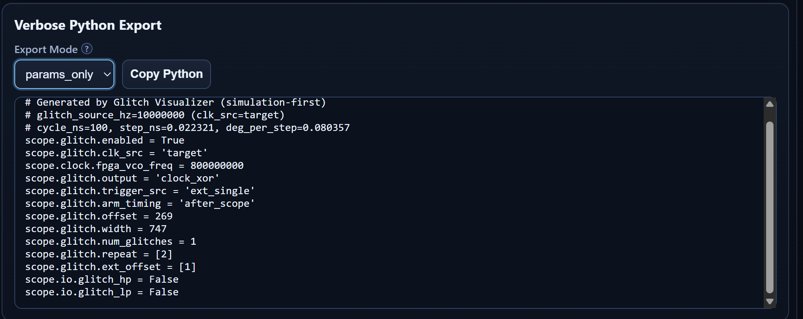

# Glitch Visualizer

An offline, browser-based tool for understanding the clock/voltage glitches produced by a **ChipWhisperer-Husky**.

Tune the glitch parameters (offset, width, repeat, external offset, trigger, clock source) and instantly see the resulting pulse on an interactive timeline — no hardware required. Then export the matching ChipWhisperer Python so you can run it for real.





## Why

Husky glitch settings are abstract: values are in *steps*, which scale to *nanoseconds* and *degrees* depending on your clock frequency and phase-shift resolution, so the same step count means different real timing on different setups. This tool makes them visual, so you can build intuition for what a given configuration actually does before touching the target.

## Run

```bash
npm install
npm run dev      # local dev server
npm run build    # production build
npm run test     # unit tests
```

## Features

- **Live timeline** — zoom and drag the glitch offset/width; values and graph stay in sync.
- **Basic & Advanced modes** — mode-aware fields with gray-out for irrelevant settings.
- **Trigger & clock source** — configure trigger and `clk_src` (target / pll) alongside the glitch.
- **Validation** — warnings for unsafe or contradictory settings, including multi-glitch cases.
- **Python export** — full stubs or params-only, one-click copy.
- **Projects** — save/load as JSON, undo/redo history, starter preset.
- **Unit converter** — steps ↔ ns ↔ degrees, with glossary tooltips throughout.

Built with React + TypeScript + Vite. Runs fully offline in the browser.
